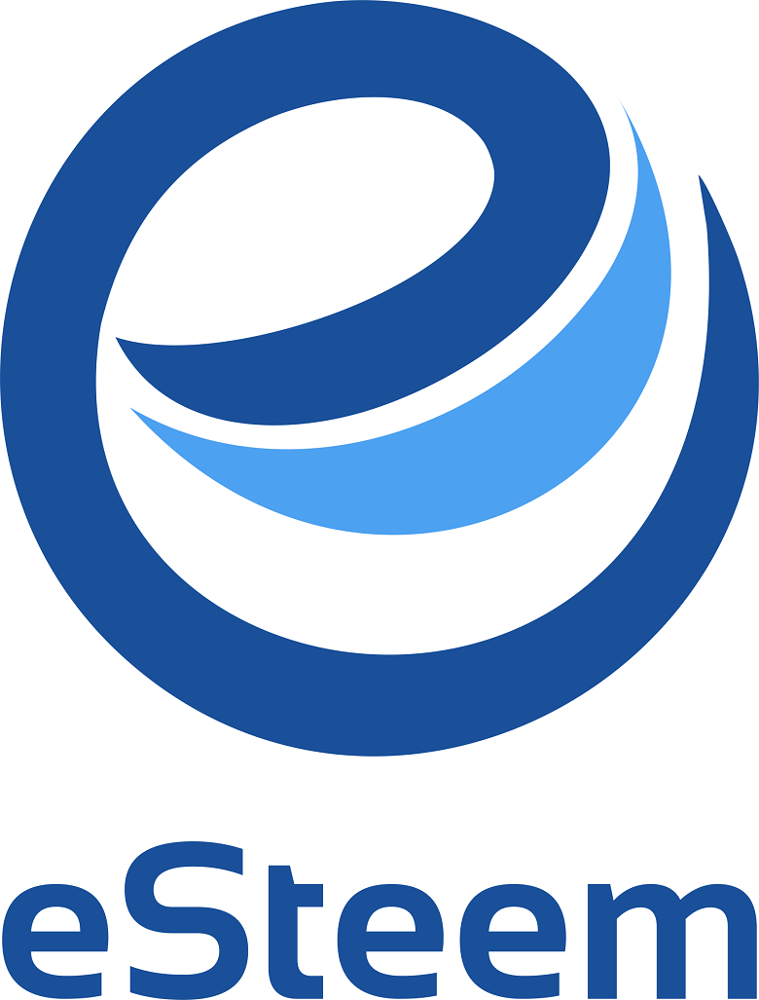
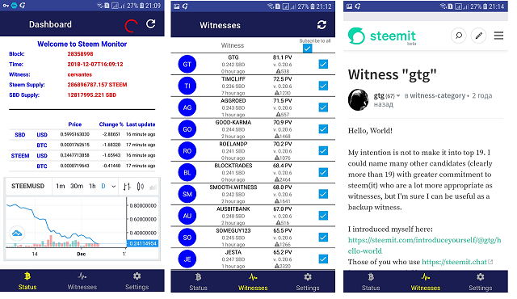

# Esteem Monitor
> Esteem Monitor is to observe steem blockchain blocks ,  steem ,sbd markets and getting push notifications about missed blocks.


With Esteem Monitor you can:
 - monitor steem blockchain (updated in  every 3 seconds)                                     
 - get the latest prices for steem and sbd with beautiful chart from Tradingview
 - Subscribe to witnesses and get push notifications about missed blocks




## Installation

OS X & Linux & Windows:

```sh
npm install app.esteem.monitor --save
```
Note: This app is for  Android only. In few days we will add for iOS too

## Usage example



## Development setup

 Development dependencies 
 -  "dsteem": "^0.9.0",
 -  "native-base": "^2.7.2",
 -  "react": "16.3.1",
 -  "react-native": "0.55.4",
 -  "react-native-firebase": "^5.1.0",
 -  "react-redux": "^5.1.1",
 -  "redux": "^4.0.1",
 -  "babel-preset-react-native": "4.0.0",
 },
## What is Steem?
Steem is a blockchain-based social media platform where anyone can earn rewards. The Steem blockchain not only holds a cryptocurrency token called STEEM, but also content created by its users, a system to vote on that content, and many other features you would find on popular social networking sites.

Visit http://www.esteem.app for more info about development and project.

# License

Permission is hereby granted, free of charge, to any person obtaining a copy of this software and associated documentation files (the "Software"), to deal in the Software without restriction, including without limitation the rights to use, copy, modify, merge, publish, distribute, sublicense, and/or sell copies of the Software, and to permit persons to whom the Software is furnished to do so, subject to the following conditions:

The above copyright notice and this permission notice shall be included in all copies or substantial portions of the Software.

THE SOFTWARE IS PROVIDED "AS IS", WITHOUT WARRANTY OF ANY KIND, EXPRESS OR IMPLIED, INCLUDING BUT NOT LIMITED TO THE WARRANTIES OF MERCHANTABILITY, FITNESS FOR A PARTICULAR PURPOSE AND NONINFRINGEMENT. IN NO EVENT SHALL THE AUTHORS OR COPYRIGHT HOLDERS BE LIABLE FOR ANY CLAIM, DAMAGES OR OTHER LIABILITY, WHETHER IN AN ACTION OF CONTRACT, TORT OR OTHERWISE, ARISING FROM, OUT OF OR IN CONNECTION WITH THE SOFTWARE OR THE USE OR OTHER DEALINGS IN THE SOFTWARE.